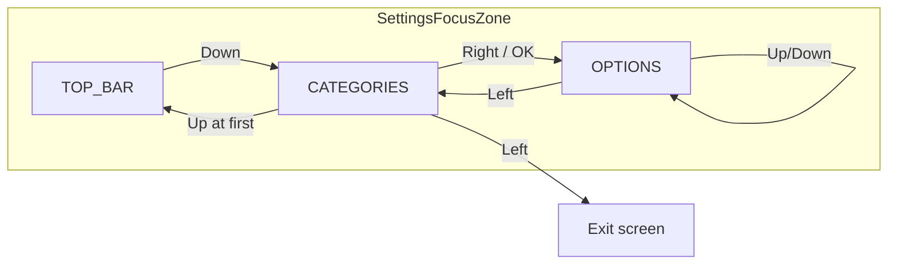

# Settings UI Redesign

June 2026 — two-column TV settings aligned with the shared focus architecture.

## Before vs after

| Before | After |
|--------|-------|
| Drill-down: full-screen category list, then full-screen detail | Persistent two-column layout: categories left, options right |
| `SettingsPanel` cards nested inside scroll containers | Flat vertical list — one setting per row |
| `SettingsFocusPanel` + 3 separate `onPreviewKeyEvent` handlers | `SettingsFocusController` + single `TvScreenFocusRoot` |
| Per-control `FocusRequester` + `LaunchedEffect` focus restoration | One `SettingsFocusDispatcher` owns `requestFocus()` |
| `SettingsFocusPillGroup` rows (many focus targets per setting) | `Selection` rows — one focus target, Left/Right cycles value |
| ~2,100 lines in `SettingsScreen.kt` | ~780 lines in `SettingsScreen.kt` + focused modules |

### Layout sketch (after)

```
┌─────────────────────────────────────────────────────────────┐
│  [Guide] [VOD] [Recordings] …                    [Profile]  │
├──────────────┬──────────────────────────────────────────────┤
│  SETTINGS    │                                              │
│              │  Buffer size              Medium             │
│  ▶ Account   │  Auto-reconnect on drop    On               │
│    Guide     │  External player          None               │
│    Playback  │  …                                           │
│    Appearance│                                              │
│    Parental  │                                              │
│    About     │                                              │
└──────────────┴──────────────────────────────────────────────┘
```

## Focus flow



| Zone | Up | Down | Left | Right | OK |
|------|----|------|------|-------|-----|
| TOP_BAR | — | Categories | Prev tab | Next tab / profile | Navigate / menu |
| CATEGORIES | Prev category / top bar | Next category | Back | Options | Options |
| OPTIONS | Prev row | Next row | Categories / cycle selection | Cycle selection | Activate row |

**Dispatcher:** `SettingsFocusDispatcher` → `categoryFocusRequesters[i]` or `optionFocusRequesters[i]` or `topBarFocusRequester`.

**Modals** (PIN, dialogs, manage profiles) block root focus handling until dismissed.

## Categories

| Category | Contents |
|----------|----------|
| Account | Profiles, connections, VOD language filter |
| Guide & EPG | Refresh, channel groups, scanner, display |
| Playback | Stream, VOD, subtitles, sleep, recordings storage |
| Appearance | Sidebar, theme, clock, D-pad |
| Parental Controls | Adult filter, PIN, max rating |
| About | Sign-in, version, updates, reset |

## New modules

| File | Role |
|------|------|
| `settings/SettingsFocusZone.kt` | Zone enum |
| `settings/SettingsFocusUiState.kt` | Focus indices |
| `settings/SettingsFocusController.kt` | D-pad logic |
| `settings/SettingsFocusDispatch.kt` | Single dispatcher |
| `settings/SettingsRowModel.kt` | Row data types |
| `settings/SettingsCategoryRows.kt` | Row builders per category |
| `settings/SettingsRows.kt` | Flat row UI |
| `settings/SettingsCategory.kt` | Category enum |

## Removed / deprecated from Settings UI path

| Component | Reason |
|-----------|--------|
| `SettingsSectionList` | Replaced by `SettingsCategoryColumn` |
| `SettingsPanel` | No cards-in-cards |
| `SettingsNavItem` | Categories use enum titles |
| `SettingsFocusPanel` enum | Replaced by `SettingsFocusZone` |
| Drill-down `detailSectionOrdinal` | Always two-column |
| `SettingsFocusPillGroup` in settings screen | Selection rows |
| `SettingsFocusToggleRow` in settings screen | `SettingsToggleRow` |
| `SettingsFocusButton` in settings screen | `SettingsActionRow` |
| `SettingsActiveProfileRow` | Info + action rows |
| `SettingsConnectionRow` | Single action row per connection |
| `SettingsFocusProfileRow` | Action row per profile |
| `ProfileColorPicker` in settings | Selection row |
| `VodPlaybackSettingsSection` in settings | Inline selection/toggle rows |
| Private `*SettingsContent` composables in `SettingsScreen.kt` | `SettingsCategoryRows.kt` |

**Kept (shared):** `SettingsFocusButton` (used by `GoogleSignInBlock`), dialog composables in `SettingsComponents.kt`, `FactoryResetConfirmDialog`, etc.

## Tests

`SettingsFocusNavigationTest` — zone transitions, focusable row indexing, row builder smoke test.

## Screenshot comparison

Screenshots require a device/emulator build. After installing a debug build, capture:

1. **Before:** checkout pre-redesign commit → Settings category list + a detail panel.
2. **After:** current build → two-column Settings with category highlight on the left.

_Update this section with image paths when captured on device._
