# Platform Intelligence Architecture

Database version **25** (`streamflow.db`). No UI in this layer — services, persistence, APIs, and simulators only.

## System Overview

```mermaid
flowchart TB
    subgraph SHI [Stream Health Intelligence]
        Player[LivePlayerManager / Failover]
        Collector[PlaybackTelemetryCollector]
        Telemetry[(playback_session_telemetry)]
        Scorer[StreamHealthScoringEngine]
        Agg[StreamHealthAggregator]
        StreamScores[(stream_source_health)]
        ChannelScores[(channel_health_aggregate)]
        ProviderScores[(provider_health_aggregate)]
        API1[StreamHealthAnalyticsService]
        Sim1[StreamHealthSimulator]
        Player --> Collector --> Telemetry
        Collector --> Agg
        Agg --> Scorer
        Agg --> StreamScores --> ChannelScores --> ProviderScores
        API1 --> StreamScores
        API1 --> ChannelScores
        API1 --> ProviderScores
        Sim1 --> Scorer
    end

    subgraph VOD [VOD Personalization]
        Watch[VodWatchTracker]
        Follow[SeriesFollowManager]
        Catalog[CatalogMonitor]
        Worker[CatalogUpdateWorker]
        Detect[NewEpisodeDetector]
        Notify[VodNotificationEngine]
        Rank[ForYouFeedRanker]
        API2[VodPersonalizationService]
        Sim2[VodPersonalizationSimulator]
        WatchEvents[(vod_watch_events)]
        Follows[(series_follows)]
        CatalogEp[(vod_catalog_episodes)]
        Notifications[(vod_user_notifications)]
        Watch --> WatchEvents
        Follow --> Follows
        Catalog --> CatalogEp
        Worker --> Catalog --> Detect --> Notify --> Notifications
        API2 --> Rank
        Sim2 --> Detect
    end
```



---

## Part 1 — Stream Health Intelligence

### Telemetry (`playback_session_telemetry`)

| Column | Type | Description |
|--------|------|-------------|
| channel_id | Long | Channel tuned |
| stream_id | String | `primary`, `backup_1`, `backup_2`, `backup_3` |
| provider_id | Long | Playlist / provider ID |
| session_start / session_end | Long | Epoch ms |
| watch_duration_ms | Long | Active watch time |
| startup_time_ms | Long | Time to first frame |
| buffering_event_count | Int | Buffer stalls |
| buffering_duration_ms | Long | Total buffer time |
| playback_error_count | Int | Fatal / recoverable errors |
| stream_switch_count | Int | Failover switches |
| reconnect_attempts | Int | Reconnect tries |
| playback_success | Boolean | Session completed successfully |

### Aggregation tables

| Table | Key | Purpose |
|-------|-----|---------|
| `stream_source_health` | (channel_id, stream_id) | Per-stream reliability |
| `channel_health_aggregate` | channel_id | Weighted blend of streams |
| `provider_health_aggregate` | provider_id | Weighted blend of channels |

Legacy `stream_health` is kept in sync for existing channel list badges.

### Health tiers

| Score | Tier |
|-------|------|
| 95–100 | Excellent |
| 85–94 | Good |
| 70–84 | Fair |
| &lt; 70 | Poor |

### Analytics API (`StreamHealthAnalyticsService`)

| Method | Returns |
|--------|---------|
| `getChannelHealth(channelId)` | Channel score + per-stream breakdown |
| `getStreamHealth(channelId, streamId)` | Single stream score |
| `getProviderHealth(providerId)` | Provider rollup |
| `getTopReliableChannels(limit)` | Highest scores |
| `getProblemChannels(limit)` | Lowest scores |
| `getFailoverRanking(channelId)` | Streams ordered for future failover |

### Failover preparation

`StreamHealthAggregator.failoverRanking()` returns stream IDs sorted by health score. `StreamFailoverController` can consume this when wired.

### Simulation

`StreamHealthSimulator` generates 10,000 sessions across channels/providers/streams and validates aggregation math and ranking order.

---

## Part 2 — VOD Personalization

### User tracking (`vod_watch_events`)

Records movies, series, and episodes with progress %, position, duration, and `last_watched`. Complements `continue_watching`.

### Following (`series_follows`)

| Field | Description |
|-------|-------------|
| following | User opted in or auto-followed |
| auto_followed | Set when ≥3 episodes watched (`AUTO_FOLLOW_EPISODE_THRESHOLD`) |

### Catalog monitoring (`vod_catalog_episodes`)

`CatalogMonitor.syncSeriesCatalog()` diffs incoming Xtream seasons/episodes against stored catalog and returns newly added episodes/seasons.

`CatalogUpdateWorker.onSeriesCatalogRefreshed()` is the hook for background catalog refresh.

### New episode detection (`NewEpisodeDetector`)

For each followed series, compares catalog episodes against `latestWatchedEpisode`. If catalog episode number &gt; last watched → `NewEpisodeDetection`.

**Love Island example:** watched E37 → catalog adds E38 → detection fires.

### Notifications (`vod_user_notifications`)

Types: `NEW_EPISODE`, `NEW_SEASON`, `SERIES_RETURNING`.

Supports in-app unread list, badge count, and `push_pending` flag (no FCM yet).

### For You feed (`ForYouFeedRanker`)

Ranking weights (highest first):

1. New episodes in followed series — **100**
2. Continue watching — **90**
3. Recent franchises — **70**
4. Recently released followed content — **50**
5. Trending — **20**

### Personalization API (`VodPersonalizationService`)

| Method | Returns |
|--------|---------|
| `getContinueWatching(profileId)` | Resume rows |
| `getFollowedSeries(profileId)` | Follow list |
| `getNewEpisodes(profileId, playlistId)` | Pending detections |
| `getForYouFeed(profileId, playlistId)` | Ranked feed |
| `getUnreadNotifications(profileId)` | In-app alerts |
| `processCatalogUpdate(...)` | Notifications from catalog diff |

### Simulation

`VodPersonalizationSimulator` runs 10k users / 5k series / 100k episodes, validates Love Island E37→E38, detection accuracy, and feed quality score.

---

## Package layout

```
feature/health/intelligence/     — telemetry, scoring, aggregation, API
feature/health/intelligence/simulation/
feature/vod/personalization/     — tracking, follows, catalog, notifications, feed
feature/vod/personalization/simulation/
data/db/entity/                  — Room entities (v25)
data/db/dao/                     — Room DAOs
di/IntelligenceModule.kt         — Hilt bindings
```

---

## Validation

Run unit tests:

```bash
./gradlew :app:testAmazonDebugUnitTest --tests "com.grid.tv.feature.health.intelligence.*" --tests "com.grid.tv.feature.vod.personalization.*"
```

Simulators produce human-readable reports via `formatReport()`.
